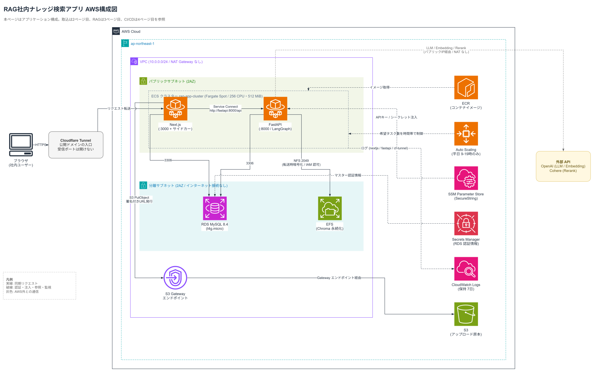
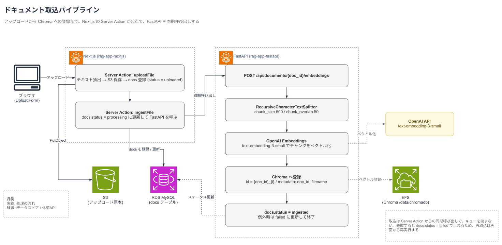
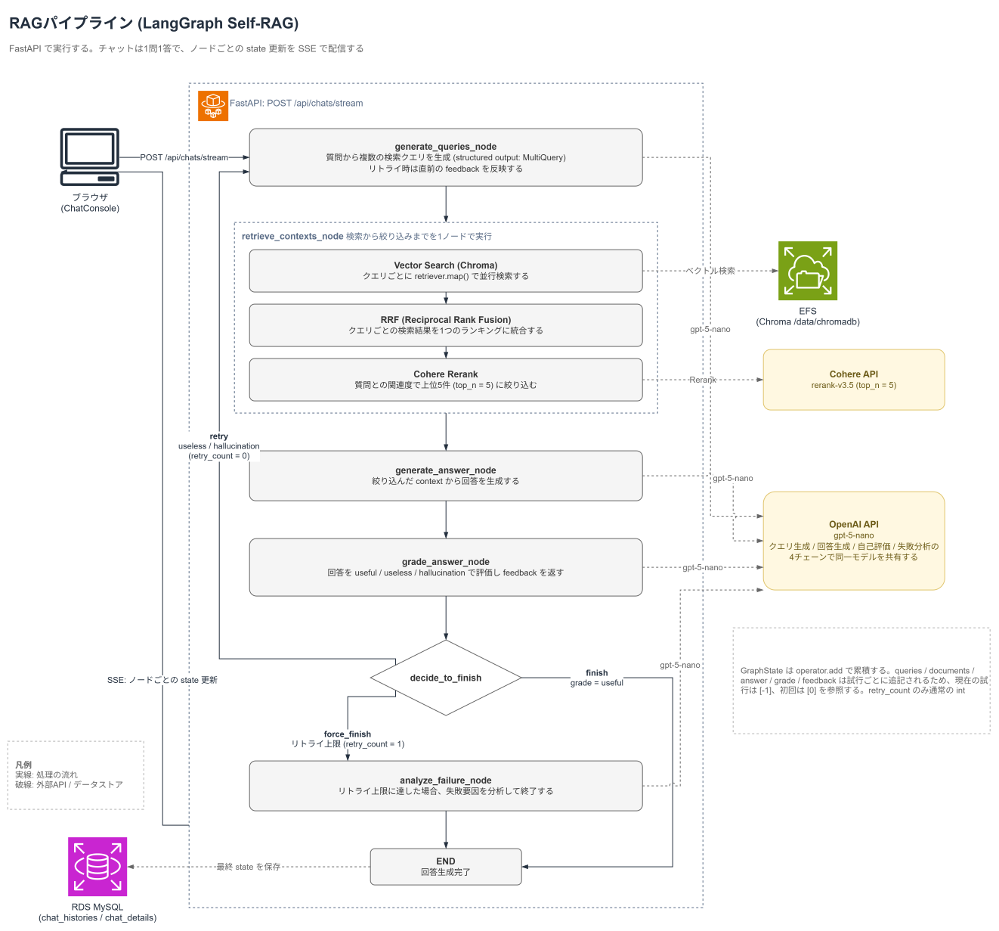
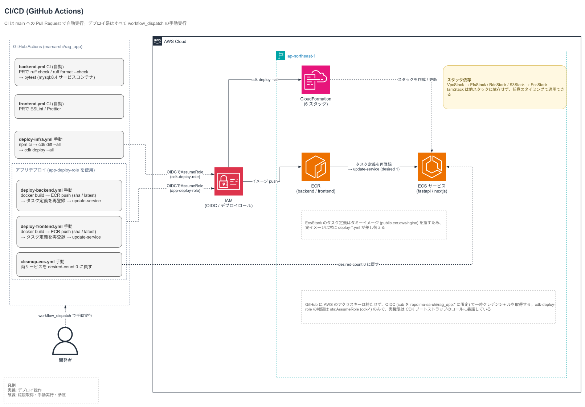

# 社内ナレッジ検索RAGアプリ

社内ドキュメントを検索し、根拠となるドキュメントに基づいて回答するRAGチャットアプリ。ECS Fargate Spotとスケジュール停止を組み合わせ、常駐構成のまま運用コストを抑える。

## デモ

## 背景と目的

手順書や過去の案件資料といった社内ドキュメントは、蓄積が進むほど保管場所が分散し、どこに何があるかを把握しづらくなる。在り処が分かっても、情報量が多ければ必要な情報を取り出すまでに時間が掛かる。

本アプリは、アップロードしたドキュメントを対象としたRAGチャットにより、必要な情報へ早くアクセスすることを目的とする。生成した回答はLLM自身が評価し、根拠が不足していれば検索クエリを変えて再試行する。チャット履歴は全ユーザーへ公開し、一度得られた回答をナレッジとして共有する。

## アーキテクチャ



フロントエンドはNext.jsのApp Routerで構成する。認証とファイルアップロードはServer ActionsからMySQLとS3を直接操作し、チャットのみRoute Handlerが`/api/chats/stream`へプロキシしてSSEをそのまま流す。FastAPIを経由しない経路があるため、フロントエンドは純粋なBFFではない。

認証はServer ActionsがMySQLの資格情報をargon2で検証し、JWTをhttpOnlyの`session_token`クッキーへ発行する。保護されたページは`getUserIdFromToken()`で検証する。

| サービス | 責務 | 実行構成 |
|---|---|---|
| rag-app-nextjs | 画面、認証、ファイルアップロード、SSEプロキシ | Fargate Spot / port 3000 / cloudflaredサイドカー |
| rag-app-fastapi | Embedding生成とChroma登録、LangGraphによるSelf-RAGの実行とSSE配信 | Fargate Spot / port 8000 / EFSマウント |

公開経路にALBは使わない。Next.jsタスク内の`cloudflared`サイドカーがアウトバウンドのトンネルを確立するため、インバウンドポートを開けずに公開でき、ALBの固定費も発生しない。2つのサービスは平日9時から19時(JST)のみ稼働し、時間外はタスク数0へスケールする。

### ドキュメント取込



アップロードと取込は分離している。アップロード時点ではファイル本体とテキストを保存するだけで、Embedding生成はユーザーが取込を実行したときに開始する。ドキュメントのステータスは`uploaded → processing → ingested | failed`と遷移する。取込では抽出済みテキストを500文字・オーバーラップ50で分割し、OpenAIのEmbeddingを生成してChromaへ登録する。

### 回答生成



回答生成はSelf-RAGで行う。Multi Query、ベクトル検索、RRFによる統合、Cohere Rerank、回答生成、自己評価、最大1回のリトライという流れをLangGraphのStateGraphで構成している。

自己評価が`useless`または`hallucination`であればフィードバックを添えてクエリ生成へ戻り、リトライ後も改善しなければ失敗分析を生成して終了する。試行ごとのクエリ・検索結果・回答・評価は`chat_details`に1行ずつ保存し、後から失敗を追跡できるようにしている。

### CI/CD



GitHub ActionsのAWS認証はOIDCで行い、長期アクセスキーを持たせない。プルリクエストではlintとテストのみをパスフィルタ付きで実行し、デプロイはインフラ・バックエンド・フロントエンドとも`workflow_dispatch`による手動実行とする。

インフラ構成の詳細は[cdk/README.md](./cdk/README.md)に記載する。

## 技術スタック

| 領域 | 採用技術 |
|---|---|
| フロントエンド | Next.js 16(App Router) / React 19 / TypeScript / Tailwind CSS 4 / jose / argon2 |
| バックエンド | Python 3.13 / FastAPI / LangGraph / LangChain / aiomysql / Poetry |
| データストア | MySQL 8.4 / Chroma(EFS永続化) / S3 |
| インフラ | AWS CDK(TypeScript) / ECS Fargate Spot / RDS / EFS / S3 / VPC / Cloudflare Tunnel / SSM Parameter Store / Secrets Manager / ECR |
| モデル | OpenAI gpt-5-nano / OpenAI text-embedding-3-small / Cohere rerank-v3.5 |
| CI/CD | GitHub Actions(OIDC) |
| テスト・静的解析 | pytest / Ruff / ESLint / Prettier |

## 設計上の判断(ADR)

| ADR | 判断と理由 |
|---|---|
| [001 コンピュート構成の選定](./docs/adr/001-compute-architecture.md) | ECS Fargate Spotの常駐構成を採用し、平日9時から19時のスケジュール起動で常時コストを抑える |

ECS Fargate Spot(A案)、コンテナイメージLambdaへの移植(B案)、VPC外Lambda + DynamoDB + S3 Vectorsへの再設計(C案)の3案を比較した。

B案は、Chroma(SQLiteバックエンド)が同時実行数の制限を強いること、egress用のNATインスタンスが自前運用かつ単一障害点になることから見送った。C案は約14,400チャット/月を下回る利用量ではA案より低コストとなるが、データ層の移行コストを踏まえ、現時点ではA案を採用した。

## ローカル実行

```bash
cp .env.example .env   # OpenAI / Cohere のAPIキーなどを設定する
docker compose up --build
```

`backend`・`frontend`・`rdb`の3サービスが起動する。`backend`は起動時に`init_db.py`を実行し、アプリ用とテスト用のデータベースとテーブルを作成する。

- フロントエンド: `http://localhost:3000`
- バックエンドAPI: `http://localhost:8000`
- Swagger UI: `http://localhost:8000/docs`

起動確認は`/api/system/health`、`/api/system/db-test`、`/api/system/chroma-test`で行う。いずれも`{"status":"success"}`を返せば起動は完了しているが、APIキーの妥当性は取込・チャットの実行時にしか検証されない。

```bash
cd src/backend  && poetry run ruff check . && poetry run pytest
cd src/frontend && npm run lint && npm run format:check
```

`pytest`は`tests/test_documents.py`と`tests/test_chats.py`で取込からチャットまでを通しで検証する。モックを使わないため実際のOpenAI/CohereのAPIキーと、`<MYSQL_DATABASE>_test`データベースが必要になる。フロントエンドにテストフレームワークは導入していない。

CDKは`cd cdk && npm install`を一度実行したうえで`npm run diff` / `npm run deploy`を使う。CDKのテストは雛形のまま未実装のため、変更の安全確認は`npm run diff`で行う。


## リポジトリ構成

```text
src/
  frontend/           Next.js。画面、認証、アップロード、SSEプロキシ
  backend/            FastAPI。取込APIとSelf-RAGのLangGraphワークフロー
cdk/                  CDK。VpcStack / EfsStack / RdsStack / S3Stack / EcsStack / IamStack
docs/
  adr/                アーキテクチャ決定記録
  diagrams/           構成図(architecture.drawioが原本、各ページをSVGへ書き出す)
.github/workflows/    PR検証とデプロイ
```

## 今後の課題

**1. サーバーレス構成への段階移行**

現在の常駐構成は、利用のない時間帯を止めてもRDSとEFSの固定費が残る。ベクトル層、ドキュメント取込の非同期化、データ層、コンピュートとingressの4段階に分け、各段階が単独でデプロイ・後戻りできる形で移行する。詳細は[ADR 001](./docs/adr/001-compute-architecture.md)に記載する。

**2. 対話の継続**

現在は1問1答で、各質問を独立して処理している。生成された回答に対してさらに質問を重ねられるよう、履歴を文脈として扱う仕組みを追加する。

**3. Text-to-SQLによる付加価値の追加**

SQLに精通していないユーザーでも必要な情報にアクセスできるよう、自然言語からSQLを生成・実行してリレーショナルデータベースから回答を組み立てる機能を追加する。
